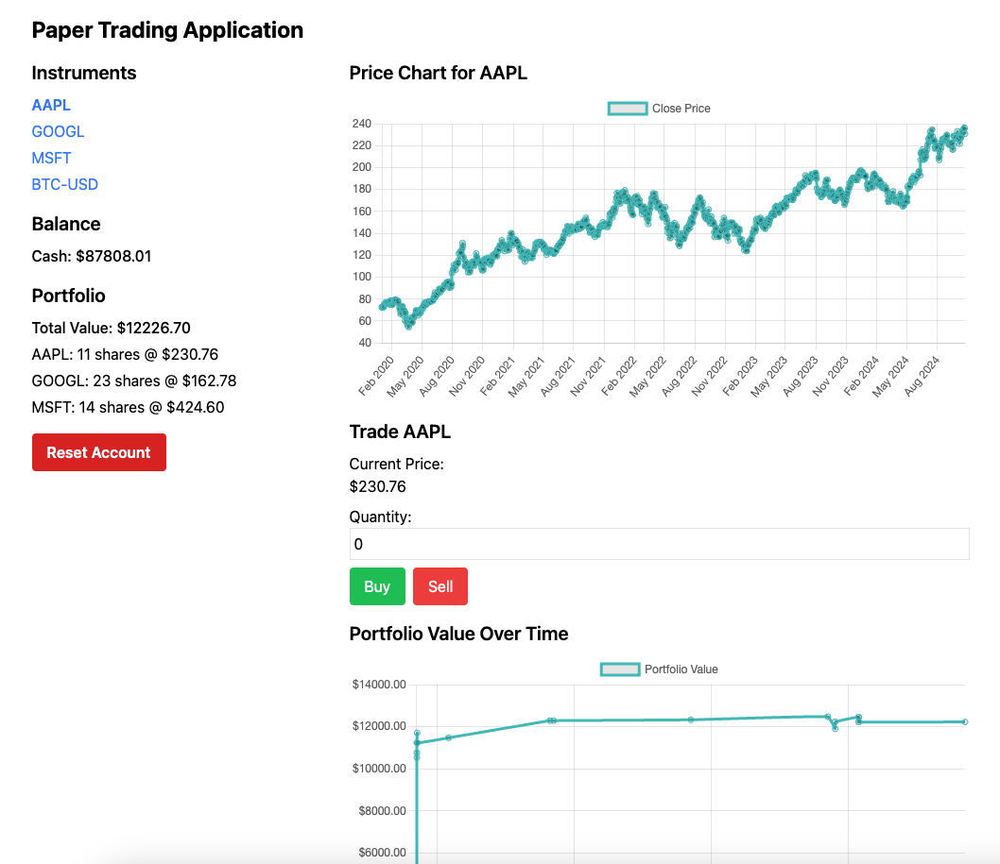

# Project

### Name: Sara Gharagozlou

---

Welcome to my project! This is a simple Django REST API backend with a React frontend for a stock trading application.

## Features

- Django backend with Django REST Framework
- React frontend
- REST API with CRUD operations

## Prerequisites

- Python 3.8+
- Node.js 12+
- pnpm or npm

## Installation

- Clone this repository: `git clone https://github.com/oddvelvetgoldfish/project-4`
- Go to the project directory: `cd project-4`

## Frontend dev server (optional)

- Go to frontend directory: `cd frontend`
- Install packages: `pnpm i` or `npm install`
- Run dev server: `pnpm dev` or `npm run dev`
- Alternatively, build the React frontend with `pnpm build` or `npm run build`

## Backend

- Go to the python directory: `cd python`
- Create virtual environment: `python -m venv venv`
- Activate virtual environment: `source venv/bin/activate`
- Install requirements: `pip install -r requirements.txt`
- Run the dev server: `python manage.py runserver`

**Now you can access the frontend dev server at localhost:5173, or the built production React app at localhost:8000!**
